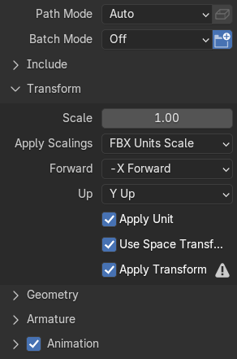
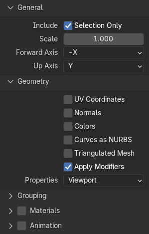

# Blender guide

## Export model as FBX with animations

Use the following export settings to export a model to FBX from Blender.

All hidden settings are left at their default values. Make sure to only include
the required objects. When exporting multiple animations, all desired animations
should be part of the NLA tracks of a model.

## Export collision shape as OBJ

Use the following export settings to export a collision shape to OBJ from
Blender.

All hidden settings are left at their default values. Make sure to only include
the required objects.

Collision shapes only need to include vertex positions. Scrap Mechanic builds a
convex hull around these.

## Normal map baking to soften hard edges

Use the `Bevel` material node available in Cycles as the normal input to the
shader node. Bake this to a normal map. The green channel of the normal map must
be inverted to render correctly in Scrap Mechanic.